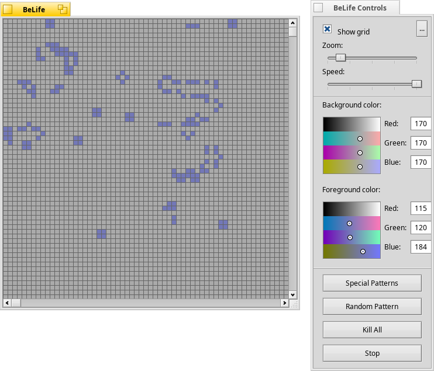

# BeLife

version 1.0 R5

by T. Lansbergen (0033)

studio-33.blogspot.com

January 26, 2066

___

___

The _Game of Life_ (or simply _Life_) is not a game in the conventional sense. There are no players, and no winning or losing. Once the "pieces" are placed in the starting position, the rules determine everything that happens later. Nevertheless, _Life_ is full of surprises! In most cases, it is impossible to look at a starting position (or pattern) and see what will happen in the future. The only way to find out is to follow the rules of the game.

## Rules of the _Game of Life_

_Life_ is played on a grid of square cells—like a chess board but extending infinitely in every direction. A cell can be live or dead. A live cell is shown by putting a marker on its square. A dead cell is shown by leaving the square empty. Each cell in the grid has a neighborhood consisting of the eight cells in every direction including diagonals.

To apply one step of the rules, we count the number of live neighbors for each cell. What happens next depends on this number.

* A dead cell with exactly three live neighbors becomes a live cell **(birth)**.

* A live cell with two or three live neighbors stays alive **(survival)**.

* In all other cases, a cell dies or remains dead **(overcrowding** or **loneliness)**.

### Note

The number of live neighbors is always based on the cells before the rule was applied. In other words, we must first find all of the cells that change before changing any of them. Sounds like a job for a computer!

### Background

_Life_ was invented by the mathematician John Conway in 1970. He choose the rules carefully after trying many other possibilities, some of which caused the cells to die too fast and others which caused too many cells to be born. _Life_ balances these tendencies, making it hard to tell whether a pattern will die out completely, form a stable population, or grow forever.

### BeOS
In BeOS I found two '_Life_' applications, a screensaver called _GLife_ and '_Life_' an application which simulates the _Game of Life_ math. Unfortunately '_Life_' had a dead link, so I hunted down the sources and tried to inprove it a little. The result is '_BeLife_'.

BeLife offers the same functionality as '_Life_', plus user defined colors, special patterns, random patterns and an option to kill all life.

#### Find out more about about Conway's Game of Life:
[Wikipedia](http://en.wikipedia.org/wiki/Conway's_Game_of_Life)
[Math.com](http://www.math.com/students/wonders/life/life.html)